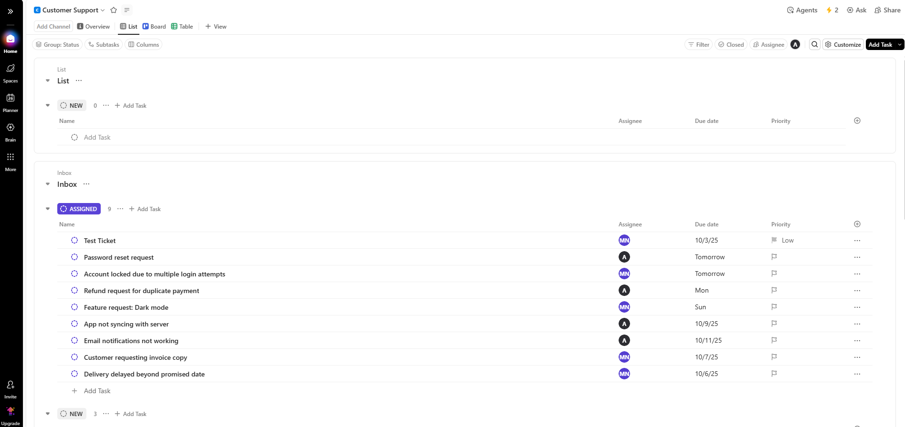
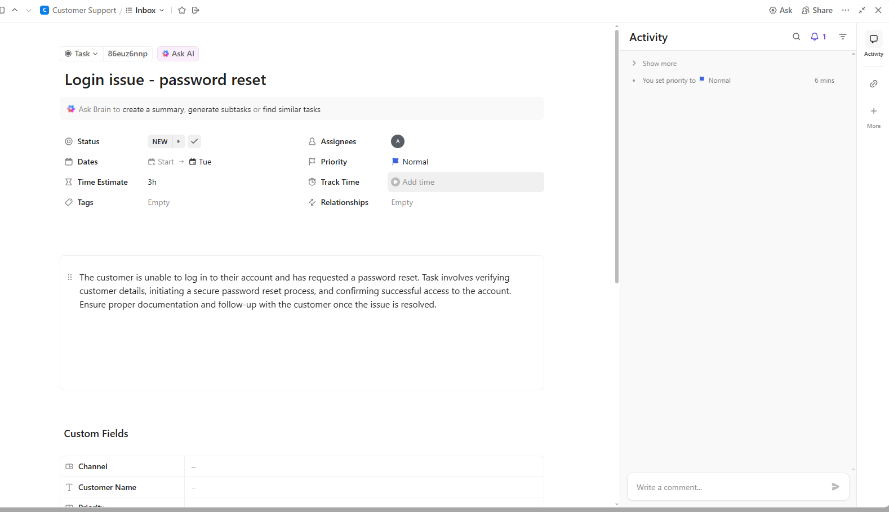
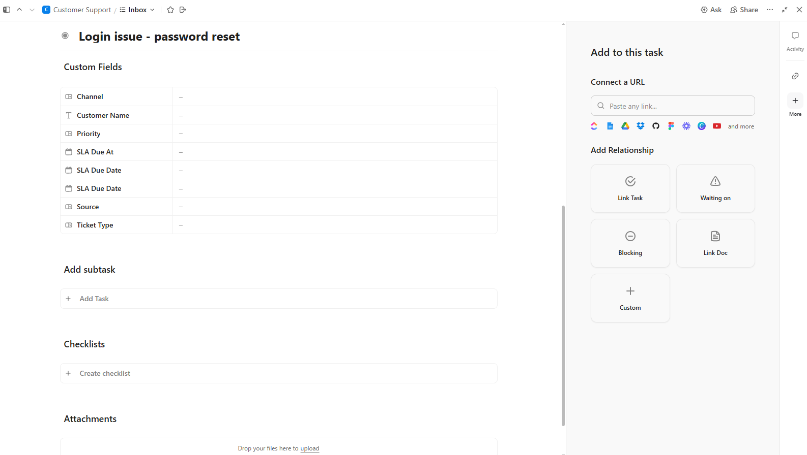
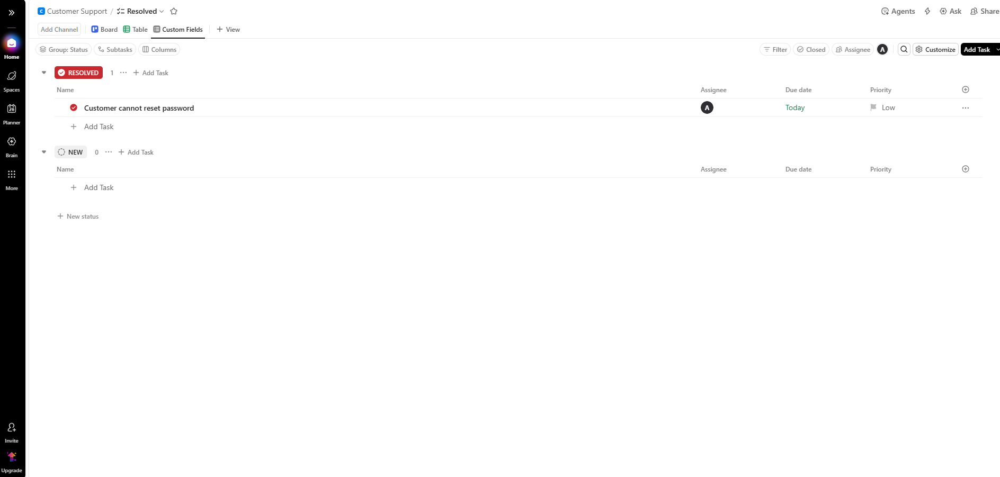
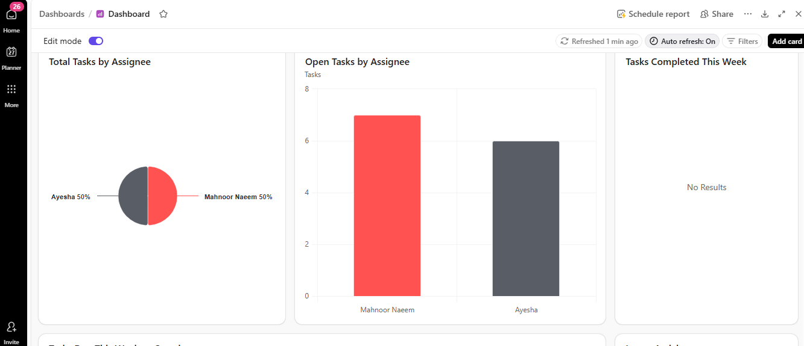
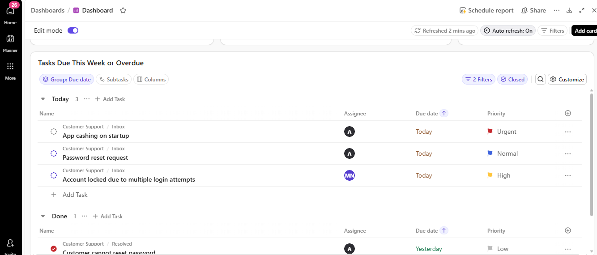
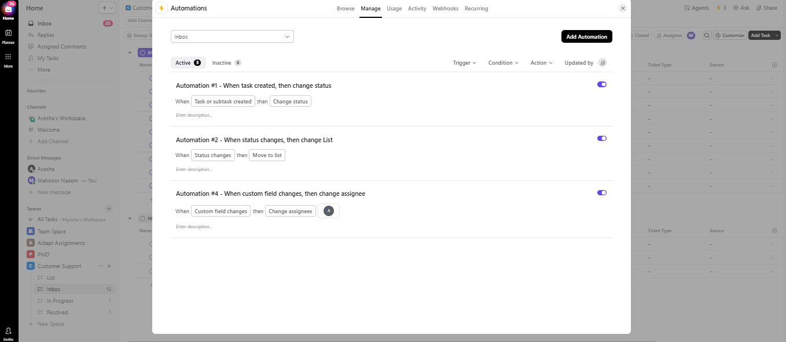
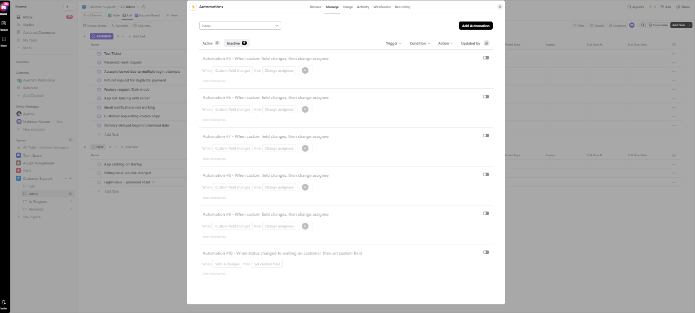

# 📞 Customer Support Project (ClickUp)

A **ClickUp-based workspace** for managing customer support tickets — from triage to resolution.  
Designed on the **ClickUp Free Plan** (no paid features required), this setup includes workflows, automations, custom fields, and screenshots for fast onboarding.  

---

## 📁 Project Structure
- **Space:** Customer Support  
- **List:** Inbox (all tickets are created and tracked here)  
- **Views:** List, Board, Table, Dashboard  

---

## 🧭 Workflow (Statuses)
| Status | Description |
|--------|-------------|
| **NEW** | Ticket just created |
| **ASSIGNED** | Owner automatically set (via rules) |
| **IN PROGRESS** | Being worked on |
| **WAITING ON CUSTOMER** | Pending customer input |
| **RESOLVED** | Solution delivered |
| **CLOSED** | Final state |

---

## 🧩 Custom Fields
- **Ticket Type:** Billing, Login/Access, Bug, Feature Request, Shipping/Delivery, General  
- **Priority:** Low, Normal, High, Urgent  
- **Channel**, **Customer Name**, **Source**  
- **SLA Due Date / SLA Due At** *(optional)*  

---

## ⚙️ Automations
- **Auto-assign by Ticket Type** → routes tickets to the correct owner  
- **SLA automation (optional)** → auto-close overdue tickets  

---

## 👀 Screenshots

| Feature | Screenshot | Description |
|---------|-----------|-------------|
| Inbox – List & Columns |  | Shows all incoming tickets with key fields for triage |
| Board – Drag & Drop by Status |  | Kanban-style view to move tickets across statuses |
| Dashboard – Overview |  | High-level summary of open tickets, workload, and support status |
| Table View – Bulk Editing |  | Spreadsheet-style view for editing multiple tickets quickly |
| Login Issue Example |   | Common login issue ticket with details |
| Custom Fields Example |  | Example of custom fields for ticket metadata |
| Dashboard Screenshot |  | Full dashboard overview screenshot |
| Dashboard Screenshot |  | Full dashboard overview screenshot |
| Dashboard Screenshot |  | Full dashboard overview screenshot |
| Automations Screenshot |  | Automation rules and workflow screenshot |
| Automations Screenshot |  | Automation rules and workflow screenshot |

---

## 📝 SOP (Daily Use)
1. Review **NEW** tickets → set Ticket Type & Priority  
2. Owner auto-assigned → move to **ASSIGNED** / **IN PROGRESS**  
3. If info required → **WAITING ON CUSTOMER**  
4. When resolved → mark **RESOLVED** → **CLOSED**  

---

## 📊 Dashboard Tips
- Add **Tasks by Ticket Type** and **Tasks by Priority** widgets  
- Adjust filters to include **NEW** status if tickets don’t appear  

---

## 🔄 Active Automations
1. **Task created → Change status to NEW**  
2. **Status changes → Move to correct list**  
3. **Custom field changes → Assign owner automatically**  

---

## 📌 Notes
- Built entirely on **ClickUp Free Plan**  
- Scalable with SLAs, integrations, and advanced automations (paid features)  
- Screenshots included for faster onboarding  

---

👩‍💻 **Owner:** Mahnoor Naeem  
**Tool:** ClickUp (Free Plan)  
