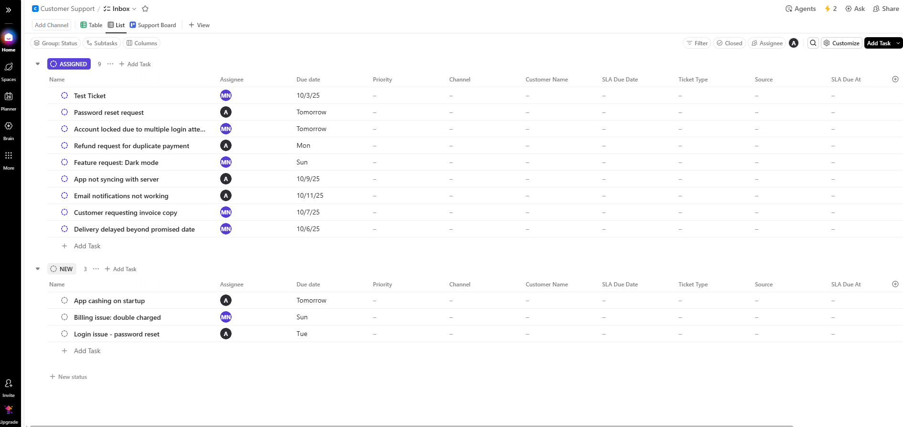
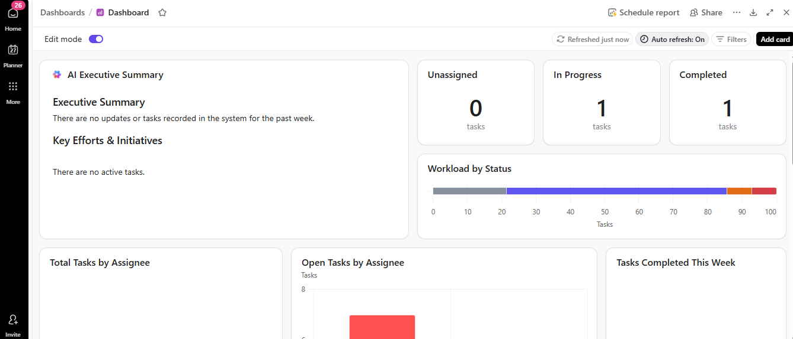
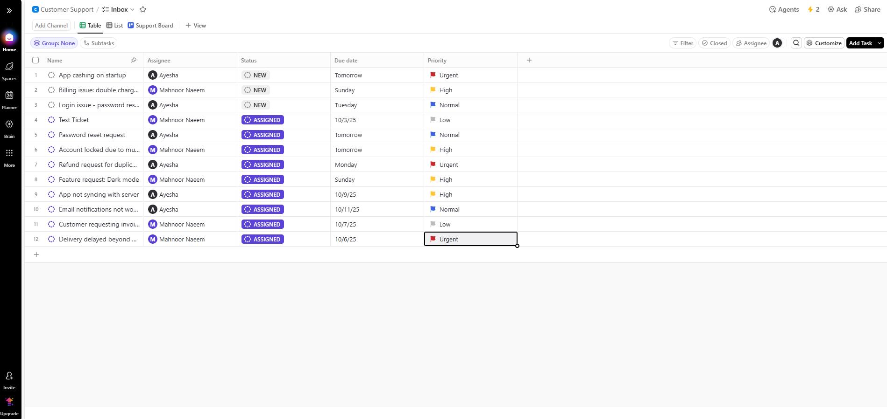

# 📞 Customer Support Project (ClickUp)

A **ClickUp-based workspace** for managing customer support tickets — from triage to resolution.  
This project is designed on the **ClickUp Free Plan** (no paid features required).  
It includes setup details, workflows, automations, and screenshots for quick onboarding.  

---

## 📁 Structure
- **Space:** Customer Support  
- **List:** Inbox (all tickets are created and tracked here)  
- **Views:** List, Board, Table, Dashboard  

---

## 🧭 Workflow (Statuses)
- **NEW** — ticket just created  
- **ASSIGNED** — owner is set (via rules)  
- **IN PROGRESS** — being worked  
- **WAITING ON CUSTOMER** — pending customer input  
- **RESOLVED** — solution delivered  
- **CLOSED** — final state  

---

## 🧩 Custom Fields
- **Ticket Type:** Billing, Login/Access, Bug, Feature Request, Shipping/Delivery, General  
- **Priority:** Low, Normal, High, Urgent  
- **Channel**, **Customer Name**, **Source**  
- **SLA Due Date / SLA Due At** *(optional)*  

---

## ⚙️ Automations
- **Auto-assign by Ticket Type** → routes tickets to the correct owner  
- **(Optional)** SLA automation → auto-close overdue tickets  

---

## 👀 Screenshots

### Inbox – List & Columns
  
*Shows all incoming tickets with key fields for triage.*  

### Board – Drag & Drop by Status
//   
  
*Kanban-style view to move tickets across statuses.*  

### Dashboard – Overview
  
*High-level summary of open tickets, workload, and support status.*  

### Dashboard – Activity
  
*Tracks ticket activity trends and workload distribution by assignee.*  

### Table View – Bulk Editing
  
*Spreadsheet-style view for editing multiple tickets quickly.*  

### Task Detail – Summary & Fields
  
*Shows description, comments, and metadata for a ticket.*  

### Automation – Auto-Assign
  
*Automatically assigns tickets based on their type (e.g., Billing).*  

### Automation – SLA (Optional)
  
*Closes tickets past their SLA due date.*  

---

## 📝 SOP (Daily Use)
1. Review **NEW** tickets → set Ticket Type & Priority  
2. Owner auto-assigned → move to **ASSIGNED** / **IN PROGRESS**  
3. If info required → **WAITING ON CUSTOMER**  
4. When resolved → mark **RESOLVED** → **CLOSED**  

---

## 📊 Dashboard Tips
- Add **Tasks by Ticket Type** and **Tasks by Priority** widgets  
- Adjust filters to include **NEW** status if tickets don’t show  

---

## 🔄 Active Automations
1. **Task created → Change status to NEW**  
2. **Status changes → Move to correct list**  
3. **Custom field changes → Assign owner automatically**  

---

## 📌 Notes
- Built entirely on **ClickUp Free Plan**  
- Scalable with SLAs, integrations, and advanced automations (paid features)  
- Screenshots included for faster onboarding  

---

👩‍💻 **Owner:** Mahnoor Naeem · **Tool:** ClickUp (Free Plan)  
